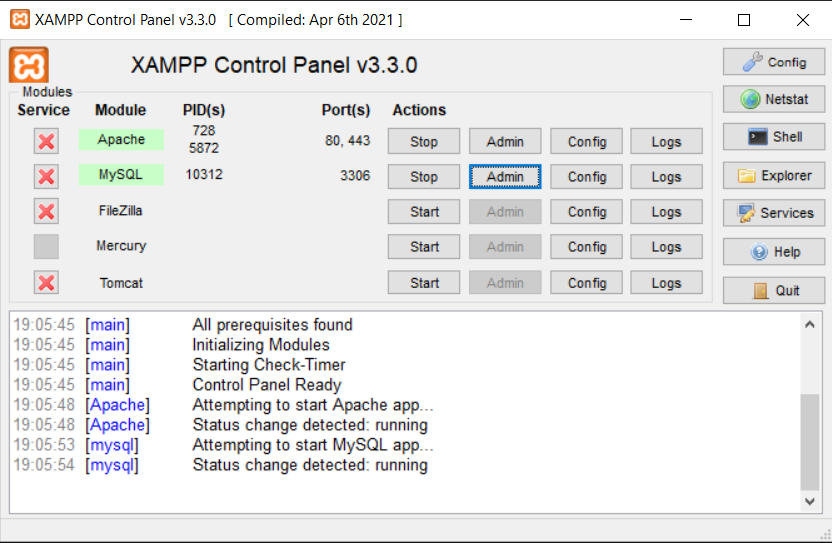
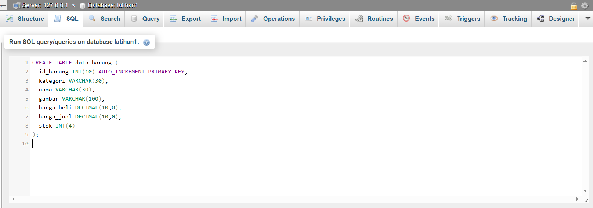
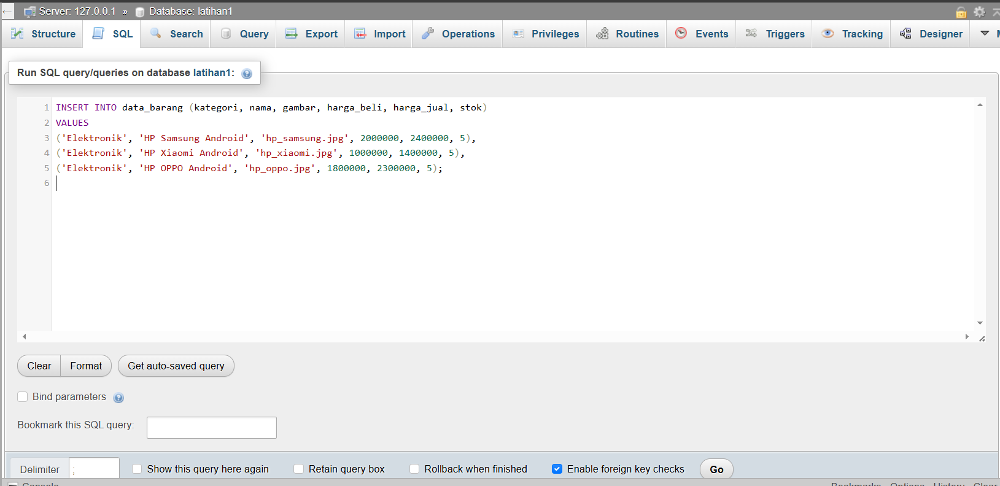
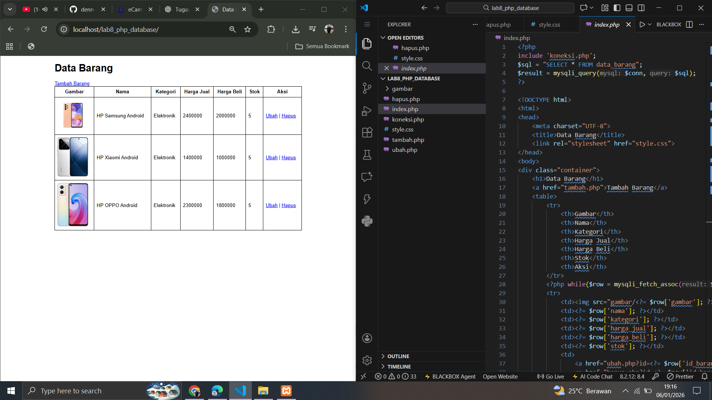
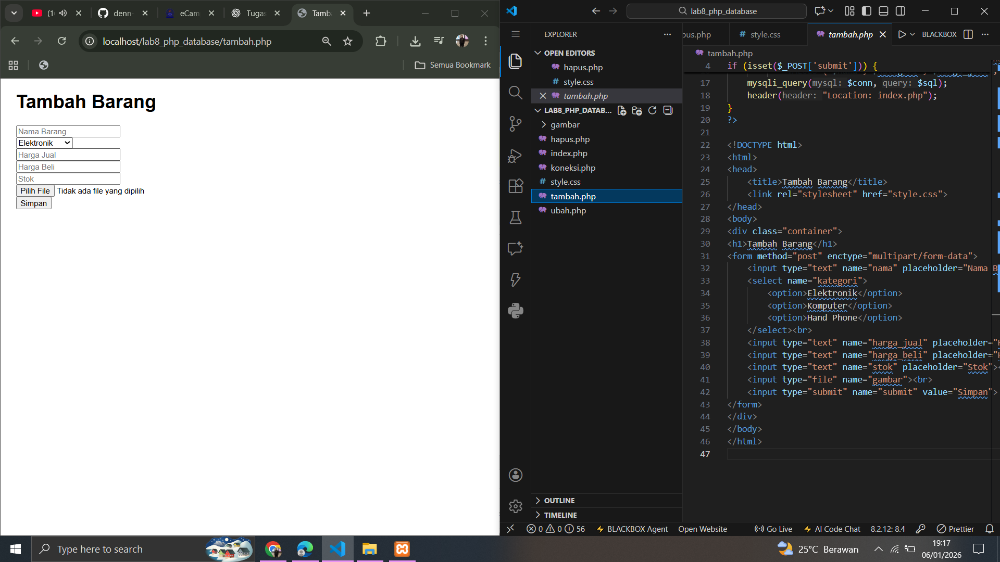
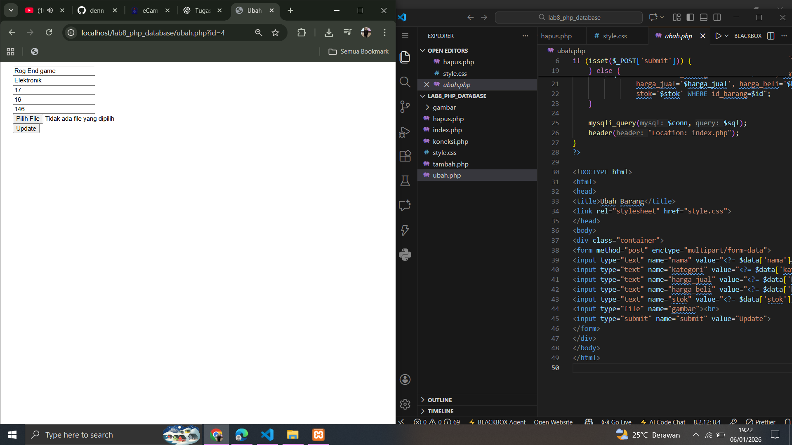
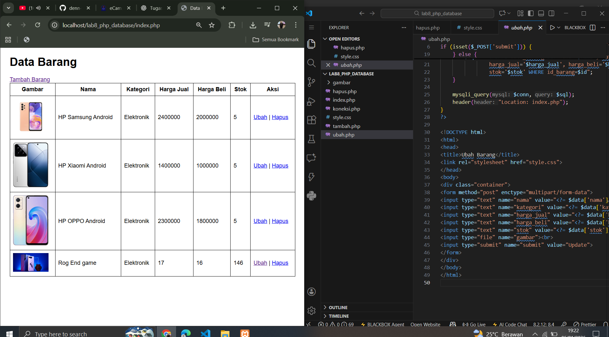
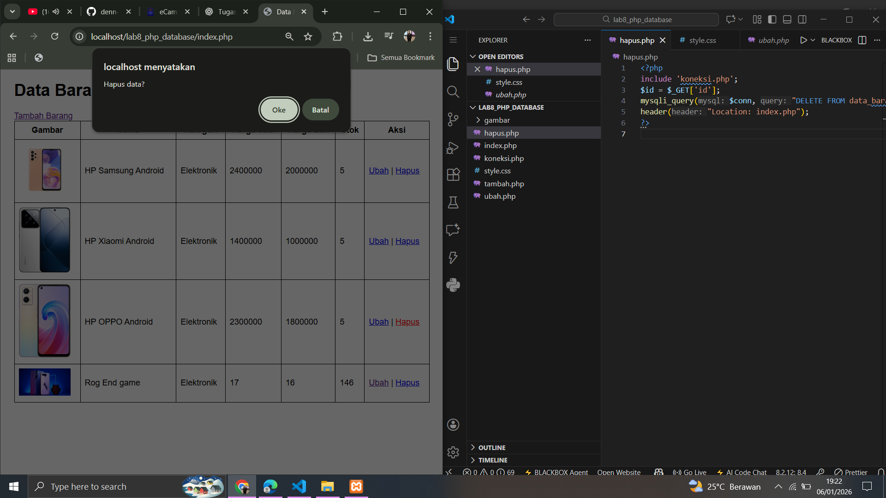
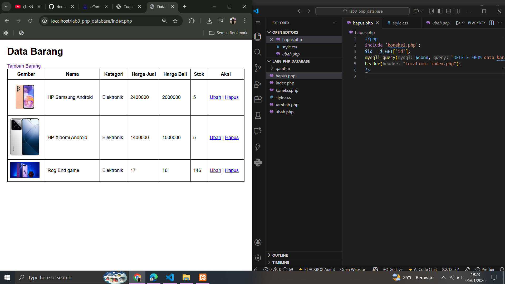

# lab8web
Nama: Den Fahmi Satria
Nim: 312410523
Kelas: TI.24.A5

## Berikut Adalah Struktur Folder
```
lab8_php_database/
│
├── gambar/
├── koneksi.php
├── index.php
├── tambah.php
├── ubah.php
├── hapus.php
└── style.css
```
## Langkah-langkah Praktikum
### 1. Menjalankan Web Server dan MySQL
Pada tahap ini, Apache dan MySQL dijalankan melalui **XAMPP Control Panel** untuk memastikan web server dan database dapat digunakan. <p>
 <p>
### 2. Mengakses phpMyAdmin
### 3. Membuat Database
Database baru dibuat dengan nama **latihan1** sebagai tempat penyimpanan data barang. <p>
 <p>

### 4. Membuat Tabel Data Barang
Tabel **data_barang** dibuat untuk menyimpan informasi barang seperti nama, kategori, harga, stok, dan gambar. <p>
 <p>
### 5. Menambahkan Data ke Tabel
Data awal dimasukkan ke dalam tabel untuk memastikan database berfungsi dengan baik dan siap ditampilkan pada aplikasi web.
 <p>
### 7. Menampilkan Data (Read)
File **index.php** digunakan untuk menampilkan seluruh data barang dari database ke dalam bentuk tabel HTML.
 <p>
### 8. Menambah Data (Create)
File **tambah.php** berfungsi untuk menambahkan data barang baru ke dalam database melalui form input.
 <p>
### 9. Mengubah Data (Update)
File **ubah.php** digunakan untuk mengubah data barang yang sudah ada di dalam database.
 <p>
 <p>
### 10. Menghapus Data (Delete)
File **hapus.php** berfungsi untuk menghapus data barang dari database berdasarkan ID yang dipilih.
 <p>
 <p>
## Hasil Praktikum
Aplikasi CRUD berbasis PHP dan MySQL berhasil dibuat dan dapat:
- Menampilkan data barang
- Menambah data barang
- Mengubah data barang
- Menghapus data barang
